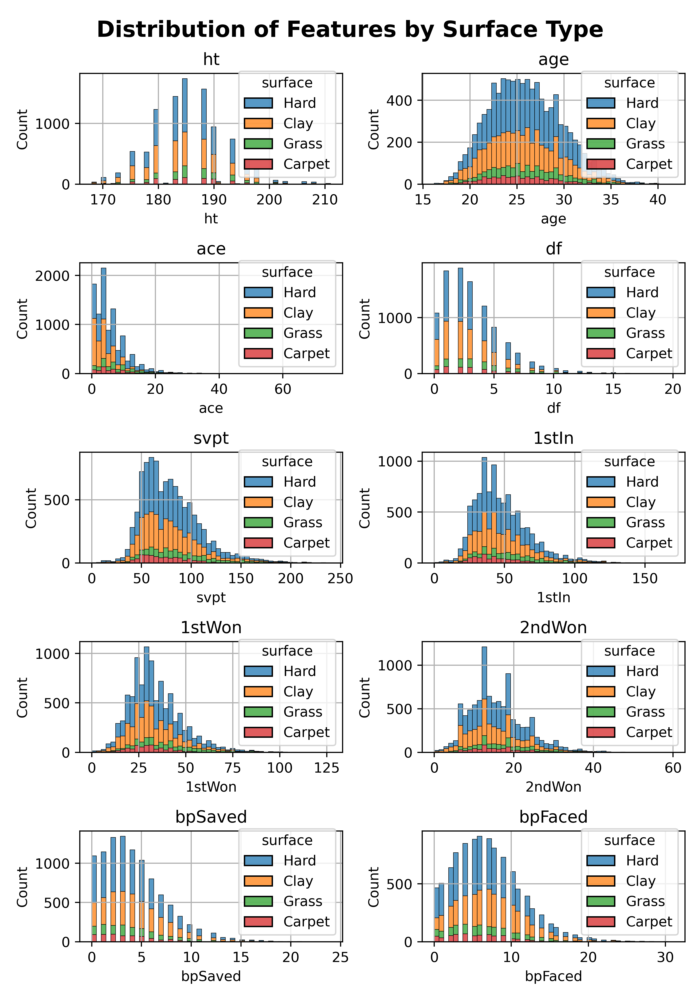
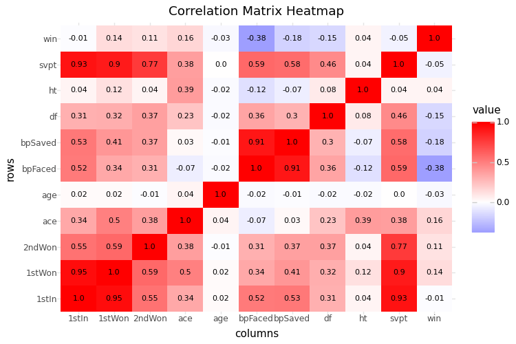

# Predicting-Professional-Tennis-Match-Outcomes
Predicting Professional Tennis Match Outcomes: A Comparative Study of Ensemble models (XGBoost/Random Forests) and Baseline Models

This project assess the effectiveness of two types different ensemble methods: random
forests and boosting to create a classifier model to predict the results of professional tennis
matches. These methods were compared against baseline models such as logistic regression
and K-nearest-neighbors. Cross validation was used in order to tune the parameters of these
models as well as evaluate the testing error and variance of their predictions. The findings
demonstrate that the XGBoost model produced the best classifier and outperformed the other
models.

## Data
The dataset used in this analysis has ATP (men’s professional tennis) match data starting from
1968 which is considered the beginning of the "Open Era" in men’s professional tennis.

However, this dataset only has complete in-game match statistics after 1991, therefore data
from after 1991 was exclusively used. The goal of this analysis is develop a prediction/classification
model that can accurately determine wether a player will win or lose a match based
on their performance.

This data was downloaded from: https://www.kaggle.com/datasets/sijovm/atpdata/data


In order to dowload the most recent version of this data see below: 

```python
import kagglehub

# Download latest version
path = kagglehub.dataset_download("sijovm/atpdata")
```

## EDA

In total, this dataset contains 26 features from over 183,000 professional matches,. Of
these 26 features only 8 pertained to in-game match performance,these along with player
height, player age, and court surface were used to train the classifiers. Additionally, I created
a binary variable (win) that indicates wether the player won or lost the match. In this analysis
the win variable will serve as the response and the rest of the data will be used as predictors.
For this analysis I selected 10,000 samples at random and created the following histograms: 







